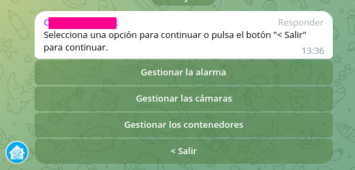

# telegram-bot

He creado un bot de Telegram para poder acceder a las siguientes interfaces en mi servidor personal:

* Gestionar el estado de la alarma (uso [Alarmo](https://github.com/nielsfaber/alarmo), un software que funciona sobre Home Assistant)
* Reiniciar las cámaras, porque alguna vez alguna se queda "colgada" (de momento he añadido soporte para TAPO usando la librería [pytapo](https://github.com/JurajNyiri/pytapo))
* Gestionar los dockers de mi servidor (básicamente pararlos o iniciarlos)
* Obtener la dirección IP del router

El código fuente está en el directorio "app"
Se puede correr sobre un docker (se incluyen el docker-compose y la receta Dockerfile correspondiente). Notar que, para el control de los dockers, se mapea en el docker el archivo /var/run/docker.sock del host.

